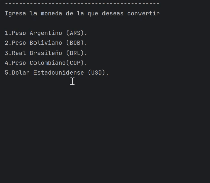

# ConversorDeMonedas
Un convertidor de monedas echo en Java, conectado a traves de una API 

Objetivos:

<li>Construir el menu donde se mostrararn la opciones de moneda origen, y destino
y la opcion de salir.</li>

<li>Hacer las solicitudes a la API.</li>

<li>Hacer las excepciones en caso de errores.</li>

<li>Crear imagenes y videos de demostracion de la aplicacion funcionando.</li>

